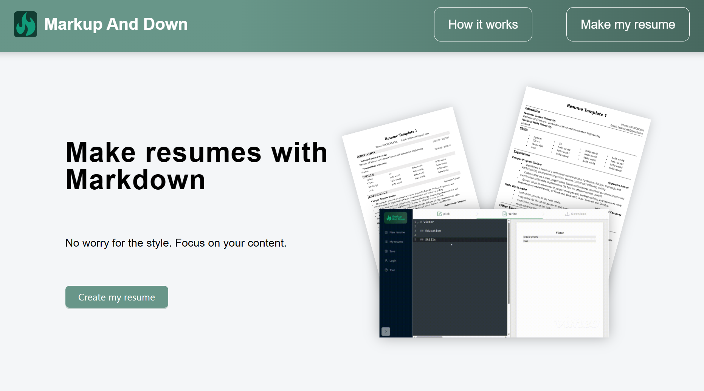

# Markup and Down
online resume maker


Markup and Down is an simple fullstack application that allows you to create a resume with markdown.


---

- [Markup and Down](#markup-and-down)
  - [Basic Info](#basic-info)
  - [Installation](#installation)
    - [Backend](#backend)
    - [Frontend](#frontend)
  - [Set up application](#set-up-application)
    - [Setup backend service with pm2 package](#setup-backend-service-with-pm2-package)
    - [Setup by docker-compose(Run services by docker container)](#setup-by-docker-composerun-services-by-docker-container)
    - [Setup by gitHub Actions](#setup-by-github-actions)
  - [npm package used](#npm-package-used)

## Basic Info
- Author: Victor Chao
- web page: http://54.64.217.57/

### Feature
- Custom markdown converter
- Preview resume result in real time
- Download your resume to PDF file
- User SignUp & SingIn


### Skills
#### Frontend
- HTML, CSS, JavaScript
- React

#### Backend
- node.js
- express
- MySQL

#### Deployment & Cloud
- AWS EC2
- AWS RDS
- gitHub Actions
- Docker

## prerequisite
- node installed

## Installation
run the application in the local.

1. clone this repo

### Backend
1. add .env file for DB connection in "backend" folder
```
MYSQL_USER = ""
MYSQL_PASSWORD = ""
MYSQL_HOST = ""
JWT_SECRET_KEY  = ""
```
2. `npm install`: Install npm package
3. `nodemon index.js`: start the backend server

### Frontend
1. add .env file
```
REACT_APP_API_URL = "http://localhost:3003"
```
2. add .env.production file for production url in "frontend" folder
```
REACT_APP_API_URL = "http://54.64.217.57"
```
3. `npm install`: Install npm package
4. `npm start`: Start the frontend page

## Set up application

### Setup by docker-compose(Run services by docker container)
1. move to the folder which has docker-compose.yml file.
2. Run docker-compose with the following command
   - add the -d will run the container in the background 
```shell
docker-compose up -d
```
3. Check the docker container status with the following command
```shell
docker-compose ps
```

> **info**: By default, docker-compose up will use the existing images for your services if they already exist.
> - Rebuild with the following command if the image need to rebuild
```shell
docker-compose up --build
```

> **warning**: Docker-compose.yml should contain the env_file setting otherwise the .env file on the ec2-instance will not be usee in the docker container.

### Setup by gitHub Actions
- simply push the commit to the ec2_testing branch and everything will works automatically.

## notes
### npm package used
- axios
- jspdf
- html2canvas
- antd
- express
- @uiw/react-codemirror
- react-draggable

### Todo
- [ ] increase the rerender speed when typing
- [ ] custom CSS setting feature for user


### Warning
> **Note**
> - This is a personal project for practicing full-stack development; it has no commercial use.
> - The link will be unavailable if the 1-year aws free tier limit is reached